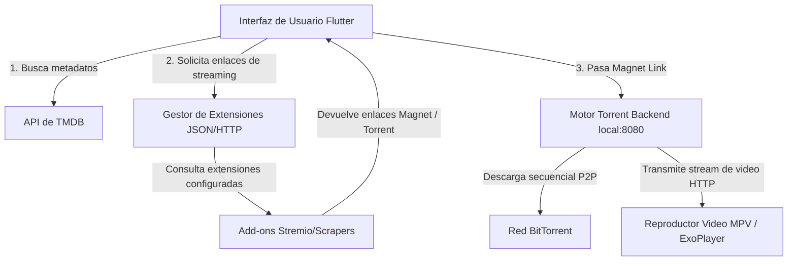

# Plan de Reconstrucción de Plezy: Plataforma de Streaming Familiar y Descentralizada (Estilo Stremio)

Este documento detalla la estrategia completa, arquitectura y especificaciones técnicas para rediseñar y reconstruir **Plezy** (actualmente un cliente de Plex/Jellyfin) para convertirla en una aplicación de streaming multimedia de catálogo público, compatible con complementos de búsqueda (scrapers) y reproducción directa de Torrents a través de un motor local secuencial, manteniendo un enfoque apto para toda la familia.

---

## 1. Visión General del Sistema

El nuevo diseño transforma a Plezy de un cliente dependiente de servidores privados (Plex/Jellyfin) a una aplicación modular y autónoma basada en tres pilares:
1. **Catálogo Público y Familiar (Frontend/Filtros)**: Utiliza **TMDB (The Movie Database)** como proveedor de metadatos por defecto. Ofrece perfiles infantiles con filtros de clasificación automáticos (G, PG, PG-13) y bloqueo de contenido adulto.
2. **Sistema de Extensiones/Proveedores (Middleware)**: Un motor que permite a los usuarios instalar complementos HTTP que siguen el protocolo de Stremio. Esto permite realizar búsquedas de enlaces magnéticos/torrents de forma descentralizada.
3. **Motor Torrent Secuencial (Backend)**: Un microservicio local embebido (en Go/Rust) que descarga las piezas del torrent en orden secuencial y expone un servidor HTTP local para transmitir el video directamente al reproductor de Plezy.

---

## 2. Requerimientos de API de Metadatos: TMDB

### ¿Necesitamos la API de TMDB?
**Sí, absolutamente.** Para mostrar contenido de inmediato sin requerir que el usuario configure un servidor de Plex o Jellyfin, necesitamos un catálogo global estructurado. TMDB ofrece una API gratuita y de altísimo rendimiento que proporciona:
*   Pósteres, fondos de pantalla, trailers e información de reparto.
*   Secciones dinámicas: Tendencias, Populares, Mejor Valoradas, Próximos Estrenos.
*   Clasificaciones por edad y géneros para control parental.
*   Estructura jerárquica de Series de TV (Temporadas y Episodios).

### Configuración e Integración de TMDB:
*   **Endpoints Clave a utilizar**:
    *   `GET /trending/{media_type}/{time_window}`: Carrusel destacado en Home (Spotlight).
    *   `GET /discover/movie` & `GET /discover/tv`: Para alimentar las filas temáticas (Acción, Comedia, Familiar, etc.).
    *   `GET /search/multi`: Para la barra de búsqueda unificada.
    *   `GET /movie/{movie_id}` & `GET /tv/{tv_id}`: Detalles del título.
    *   `GET /tv/{tv_id}/season/{season_number}`: Lista de capítulos de una temporada.
*   **Manejo de Imágenes**: Las URL de las imágenes de TMDB (`https://image.tmdb.org/t/p/{width}/{path}`) se cachearán localmente usando el componente actual `cached_network_image_ce` del proyecto.

---

## 3. Control Parental y Enfoque Family-Friendly

Para asegurar que la app sea apta para niños por defecto o mediante perfiles dedicados, se implementará lo siguiente:

1. **Gestión de Perfiles Locales (Drift Database)**:
   *   Se ampliará la base de datos de Plezy para admitir dos tipos de perfiles: **Adulto (Admin)** y **Niño (Familiar)**.
   *   El perfil de Adulto podrá protegerse mediante un PIN de 4 dígitos (aprovechando la lógica existente en `lib/screens/profile/pin_entry_dialog.dart`).

2. **Filtros Activos de TMDB en Perfiles Familiares**:
   *   Al consultar la API de TMDB para perfiles infantiles, se agregará de forma forzada el parámetro `include_adult=false`.
   *   Se filtrará utilizando el parámetro `certification_country=US` y limitando las clasificaciones mediante `certification.lte=PG-13` (o `PG` según el nivel configurado por el padre).
   *   Se excluirán géneros no aptos (como Terror gore, Thriller erótico, etc.) a nivel de consulta agregando `without_genres=...` en las llamadas a `/discover`.

3. **Restricción de Extensiones**:
   *   Se podrá bloquear la instalación de nuevas extensiones en los perfiles infantiles, mostrando únicamente un catálogo curado por el perfil administrador.

---

## 4. Arquitectura de Extensiones (Add-ons): Remotas (Dart/HTTP) y Locales (Go + Goja JS Engine)

Para lograr la máxima flexibilidad y compatibilidad, Plezy implementará un sistema híbrido de extensiones:

### A. Extensiones Remotas (Protocolo Stremio HTTP)
Las extensiones estándar de Stremio son simples microservicios HTTP. Su arquitectura es 100% asíncrona y no requiere ejecutar código JS localmente:
1.  **Instalación**: El usuario ingresa la URL de un manifiesto público (ej. `https://torrentio.strem.fun/manifest.json`).
2.  **Consulta asíncrona**: Cuando el usuario selecciona una película (ej. con ID de IMDb `tt0111161`), el frontend de Flutter (Dart) realiza peticiones concurrentes y asíncronas vía HTTP:
    `GET https://torrentio.strem.fun/stream/movie/tt0111161.json`
3.  **Procesamiento**: Dart procesa el JSON resultante y muestra las opciones de streaming. Dado que Dart tiene un soporte asíncrono robusto nativo (`async/await`, `Futures`), esto se ejecuta en paralelo a gran velocidad sin bloquear la interfaz.

---

### B. Extensiones Locales por Scripting (Motor JS/TS con Goja en el Backend de Go)
Si un usuario desea instalar un script local (archivo `.js` o `.ts` de raspado que no esté alojado en un servidor externo), ejecutarlo en Dart presenta serias limitaciones (dificultades para manejar HTTP asíncrono dentro de QuickJS y problemas de compilación nativa en móviles).

Para solucionar esto de manera elegante y potente:
1.  **Motor Goja en Go**: El backend en Go incluirá **Goja (github.com/dop251/goja)**, un intérprete de ECMAScript 5.1 escrito en Go puro.
    *   *Ventaja de Goja*: Al ser Go puro (sin CGO), se compila sin esfuerzo para Windows, macOS, Linux, Android y iOS.
2.  **Ciclo de Vida de los Scripts Locales**:
    *   Los scripts locales se guardan en el directorio de datos de la app (ej. `addons/local_scraper.js`).
    *   Al arrancar, el backend en Go carga estos scripts en instancias independientes de Goja.
3.  **Inyección del Entorno de Red (Fetch en Go)**:
    *   Como Goja no incluye APIs de red por defecto, el backend en Go inyectará funciones nativas en el contexto JS. Por ejemplo, una función `fetch()` implementada en Go que maneja de forma asíncrona las llamadas HTTP reales (soportando cabeceras personalizadas, User-Agents de navegador y manejo de cookies para evadir bloqueos).
4.  **Exposición como API HTTP Local**:
    *   El backend en Go envuelve la ejecución del script JS y la expone como un endpoint de Stremio en el servidor local.
    *   Ejemplo: Flutter consulta a `http://localhost:8080/local-addon/my-scraper/stream/movie/tt0111161.json`. El backend de Go recibe la petición, ejecuta la función correspondiente en Goja usando Goroutines de forma no bloqueante, y devuelve el JSON con los torrents/enlaces de streaming a Flutter.

Este diseño híbrido combina lo mejor de ambos mundos: la compatibilidad directa con los miles de add-ons HTTP de Stremio (en Dart) y la capacidad de ejecutar scrapers locales programados en JavaScript/TypeScript sin comprometer la compilación ni el rendimiento de la UI (en Go mediante Goja).

---

## 5. Motor Torrent del Backend (Sequential Torrent Engine)

Para reproducir un Torrent en tiempo real sin descargar todo el archivo previamente, necesitamos un motor de torrent secuencial local.

### Alternativa Seleccionada: Go Helper Daemon (`github.com/anacrolix/torrent`)
*   **Por qué Go?**: Go posee la biblioteca de Torrent más estable, rápida y madura para descargas secuenciales (`anacrolix/torrent`). Permite realizar búsquedas DHT rápidas y manejar prioridades de piezas de forma nativa.
*   **Cómo se integra en el dispositivo**:
    *   **Escritorio (Windows/macOS/Linux)**: Se compila un binario ejecutable ligero de Go (`plezy-torrent-server`) y se empaqueta en los recursos de la aplicación. Flutter inicia el proceso en segundo plano en el arranque del sistema.
    *   **Móvil (Android/iOS)**: Se compila la librería de Go en formato de librería nativa (`.aar` para Android, `.framework` para iOS) utilizando `gomobile bind`. Se inicializa desde Flutter a través de canales de plataforma nativos.
*   **Flujo de Streaming**:
    1.  El usuario selecciona un enlace torrent en la UI de Plezy.
    2.  Plezy envía el Magnet Link o InfoHash al motor local:
        `POST http://localhost:8080/play?magnet=...`
    3.  El motor de torrent inicia la descarga secuencial: da prioridad absoluta a la pieza 0, 1, 2, etc., en lugar del orden aleatorio habitual de BitTorrent.
    4.  El motor expone un servidor HTTP local.
    5.  El reproductor de video de Plezy (MPV en escritorio, ExoPlayer en Android) abre la URL:
        `http://localhost:8080/stream/{infoHash}`
    6.  El reproductor solicita porciones del archivo mediante cabeceras HTTP de rango (`Range: bytes=0-1048576`). El motor de Go responde a estas solicitudes pausando la conexión si las piezas requeridas aún no están descargadas y reanudándola tan pronto como lleguen desde la red BitTorrent.

---

## 6. Fases de Implementación y Reconstrucción de Código

A continuación se detalla cómo modificar el código actual de Plezy estructurado en carpetas para lograr esta reconstrucción:

### Fase 1: Desacoplamiento de Plex/Jellyfin y Home UI por Defecto
*   **`lib/main.dart`**: Modificar el punto de entrada para omitir la validación obligatoria de servidores Plex/Jellyfin en el bootstrap de la app si no hay cuentas vinculadas. Iniciar directamente en el Dashboard.
*   **`lib/screens/main_screen.dart`**: Cambiar la navegación lateral y el flujo para apuntar a la nueva pantalla de inicio unificada.
*   **`lib/screens/discover_screen.dart`**: Rediseñar la pantalla de descubrimiento para consumir datos de `TmdbProvider` en lugar de `DiscoverProvider` (que depende de Plex/Jellyfin).
*   **`lib/providers/tmdb_provider.dart`** `[NEW]`: Crear un nuevo proveedor de estado que maneje el catálogo público y los filtros familiares basados en el perfil actual.

### Fase 2: Motor de Add-ons y Base de Datos
*   **`lib/database/app_database.dart`**: Agregar tablas SQLite (usando Drift) para registrar las extensiones instaladas por el usuario (URL del manifiesto, nombre, ícono, estado activo/inactivo).
*   **`lib/services/extensions_service.dart`** `[NEW]`: Desarrollar el cliente HTTP que maneje el ciclo de vida de los Add-ons (descarga de manifiesto, resolución de streams).
*   **`lib/screens/extensions_manager_screen.dart`** `[NEW]`: Pantalla de configuración para instalar, desinstalar y probar URLs de Add-ons de la comunidad.

### Fase 3: Detalle de Medios con Enlaces Torrent
*   **`lib/screens/media_detail_screen.dart`**: Adaptar el cargador de detalles para obtener la información extendida de la película/serie directamente de TMDB. Reemplazar los botones de reproducción de Plex/Jellyfin por una sección de "Enlaces de Reproducción" que consulte en tiempo real a las extensiones y muestre los torrents encontrados con detalles de calidad y semillas (seeds/peers).

### Fase 4: Integración del Motor Torrent y Reproducción
*   **`lib/services/torrent_engine_service.dart`** `[NEW]`: Servicio en Dart para controlar el demonio local de torrents (arranque del proceso, detención, monitoreo de velocidad de descarga/subida, porcentaje de buffer, salud del torrent).
*   **`lib/screens/video_player_screen.dart`**: Modificar el inicializador del reproductor para que, al reproducir un torrent, pase la URL local `http://localhost:8080/stream` al motor de video (MPV) junto con el título y portadas.

---

## 7. Plan de Verificación y Pruebas

Para garantizar que la reconstrucción no rompa la fluidez de la app (especialmente en dispositivos de televisión y Android TV, donde Plezy destaca), se realizarán las siguientes pruebas:

### Pruebas Automatizadas:
1.  **Pruebas unitarias de TMDB Service**: Verificar el correcto parseo de respuestas y la aplicación de filtros familiares (certificaciones PG/G).
2.  **Pruebas de Protocolo de Add-ons**: Probar llamadas simuladas a manifiestos e integración con respuestas mockeadas de streams.
3.  **Pruebas de Drift Database**: Validar la persistencia de perfiles y URLs de extensiones.

### Pruebas Manuales y de Rendimiento:
1.  **Flujo de Reproducción Instantánea**: Verificar el tiempo transcurrido desde que se selecciona un torrent hasta que el reproductor de video comienza a emitir imágenes (tiempo de buffering inicial).
2.  **Compatibilidad de D-pad**: Validar que la interfaz de selección de streams sea 100% navegable con control remoto en Android TV y Apple TV.
3.  **Prueba de Control Parental**: Verificar que en los perfiles de niños no se muestren contenidos con clasificaciones adultas bajo ninguna circunstancia, incluso realizando búsquedas explícitas.

---

## Preguntas Abiertas para el Usuario

> [!IMPORTANT]
> **1. ¿Cómo prefieres manejar los servidores actuales de Plex/Jellyfin?**
> *   *Opción A (Recomendada)*: Mantenerlos como un "proveedor" opcional más dentro de la app (así el usuario puede reproducir contenido de su Plex O de torrents públicos).
> *   *Opción B*: Eliminar por completo el soporte de Plex y Jellyfin para simplificar al 100% el codebase enfocado en streaming descentralizado.
>
> **2. ¿Deseas soporte para servicios de Debrid (Real-Debrid, Premiumize, AllDebrid)?**
> Los servicios de Debrid permiten descargar torrents instantáneamente desde servidores HTTP de alta velocidad en lugar de la red P2P clásica. Es una característica muy popular en Stremio.
>
> **3. ¿Suministrarás una API Key de TMDB propia, o configuramos un proxy por defecto para la app?**
> TMDB requiere una clave de desarrollador. Podemos incluir una por defecto encriptada en la app o pedirle al usuario que introduzca la suya en los ajustes.
